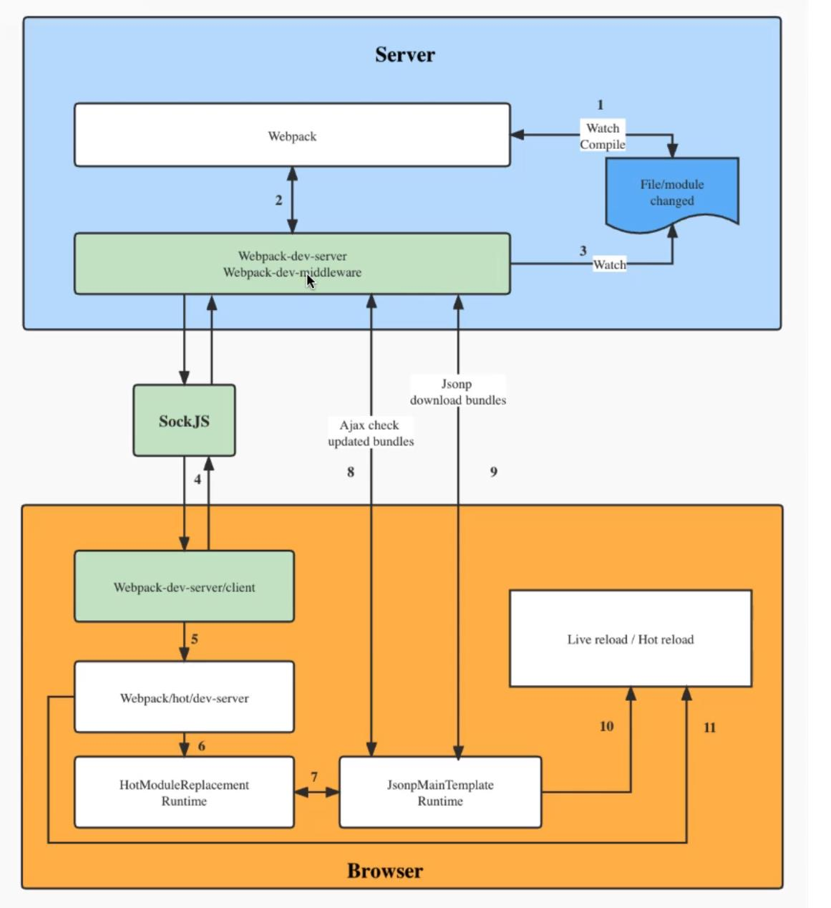
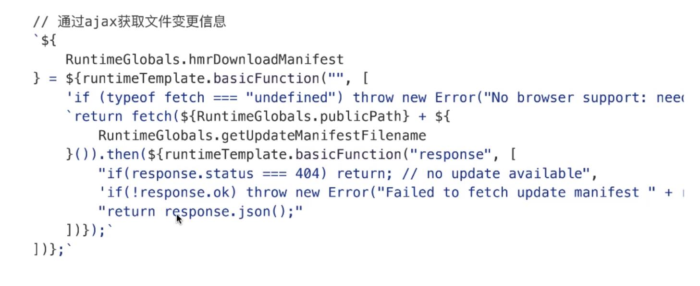
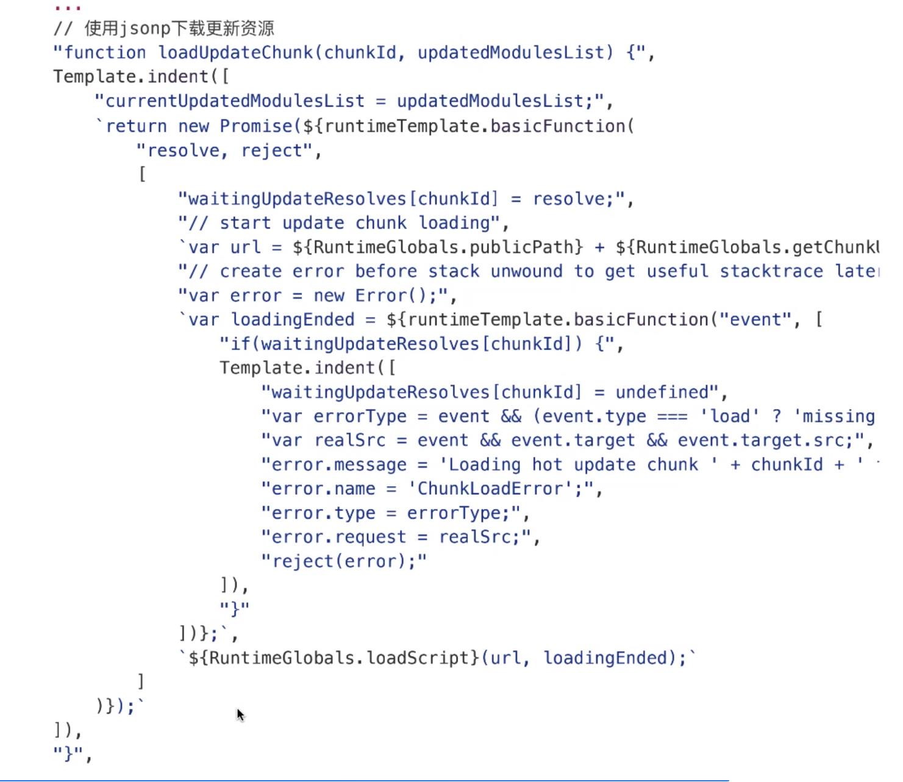

## HMR 实现原理

1. HMR 处理流程

- 理解问题
  - webpack-dev-middleware 在 HMR 中扮演什么角色
  - 打包后的新模块是通过什么方式发送到浏览器端
  - 浏览器拿到最新的模块代码，HMR 又是怎么将旧的模块替换成新的模块，在替换的过程中怎么处理模块之间的依赖关系
  - 当模块的热更新过程中，如果替换模块失效，有什么容错机制



2. 关键代码

- 服务端 webpack-dev-server/lib/Server.js

```
  this.compiler.hook.done.tap(
    "webpack-dev-server",
    (stats) => {
      if (this.webSocketServer){
        //通过socket通知浏览器
        this.sendStats(this.webSocketServer.clients, this.getStats(stats))
      }
      this.stats = stats
    }
  )
  ...
  sendStats(clients, stats, force){
    this.sendMessage(clients, "hash", stats.hash)
    ...
    this.sendMessage(clients, "ok")
  }
```

- 客户端 webpack-dev-server/client-src/index.js

```
  hash(hash){
    status.previousHash = status.currentHash
    status.currentHash = hash
  }

  ok(){
    sendMessage("Ok")
    if(options.overlay){
      hide()
    }
    reloadApp(options, status)
  }

```

- 客户端 webpack-dev-server/client-src/utils/reloadApp.js

```
  if(hot && allowToHot){
    hotEmitter.emit("webpackHotUpdate", status.currentHash)
  } else if(liveReload && allowToLiveReload){
    let rootWindow = self

    // 使用顶部window来刷新
    const intervalid = self.setInterval(() => {
      if(rootWindow.location.protocal !== "about:"){
        // 如果protocal有效立即重新加载
        applyReload(rootWindow, intervalid)
      }else {
        rootWindow = rootWindow.parent
        if(rootWindow.parent === rootWindow){
          // 如果父window和当前的window相同
          applyReload(rootWindow, intervalid)
        }
      }
    })
  }

  function applyReload(rootWindow, intervalid){
    clearInterval(intervalid)
    rootWindow.location.reload()
  }

```

- 客户端 webpack-dev-server/web/JsonpChunkLoadingRuntimeModule.js
  
  

- 客户端 webpack-dev-server/lib/hmr/JavascriptHotModuleReplacement.runtime.js

```
  dispose: function(){
    // 从内存中删除module
    // 从所有子项中移除 “parents” 关联
  }
  apply: function(){
    // 插入新的code
    // 运行最新的运行时module
    // call 接收的方法
    //我们注册的局部更新方法，在这里被调用
  }
```
