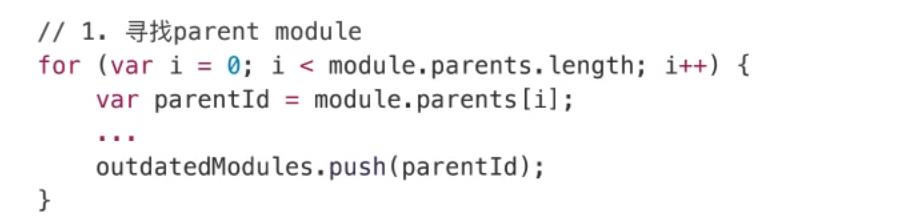
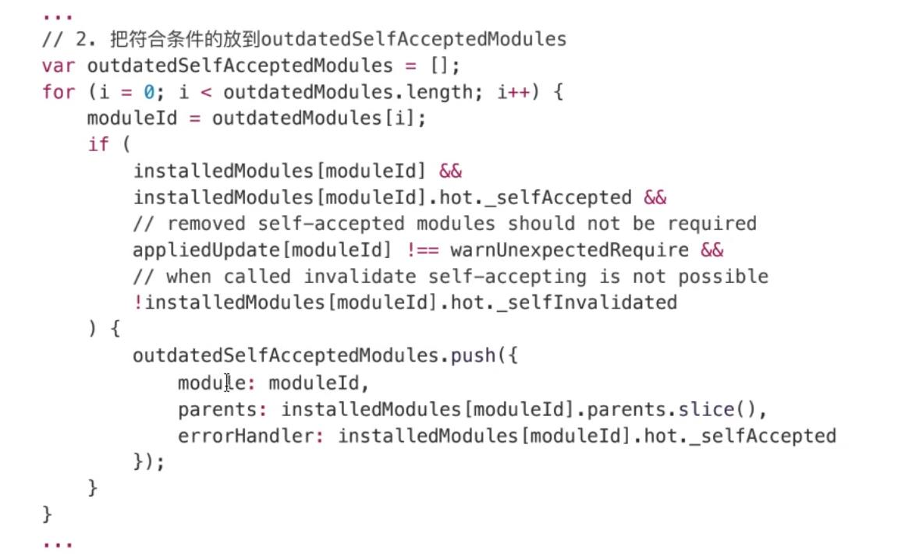
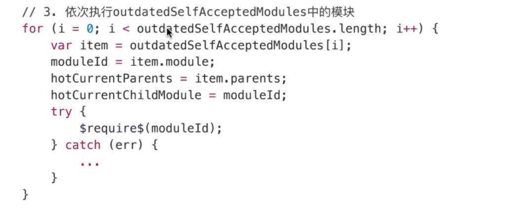
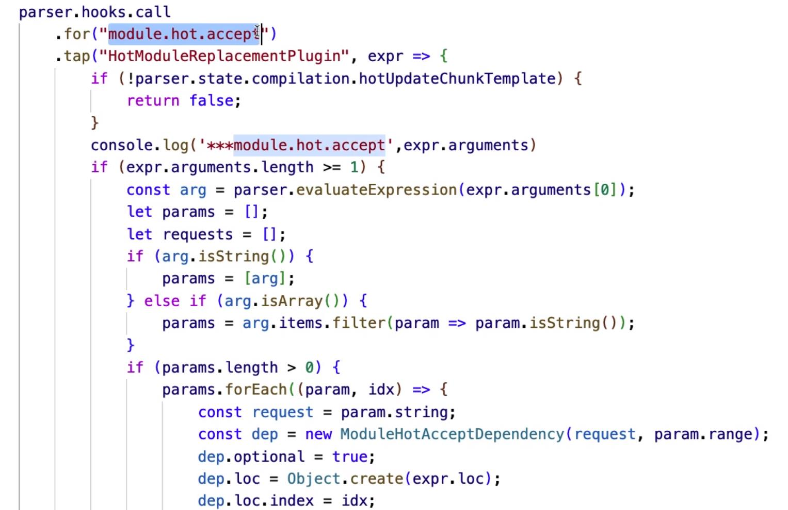

## HMR 客户端实现原理

1. 当 entry 文件中指定 module.hot.accept()事，当前模块或者子模块改变时，会触发 entry 文件重新运行

- 调用关系：HotModuleReplacement.runtime.js --> hotApply --> hotApplyInternal

2. 当 entry 文件中指定 module.hot.accept()具体模块的时候，只会重新更新该模块，不会更新父模块

   
