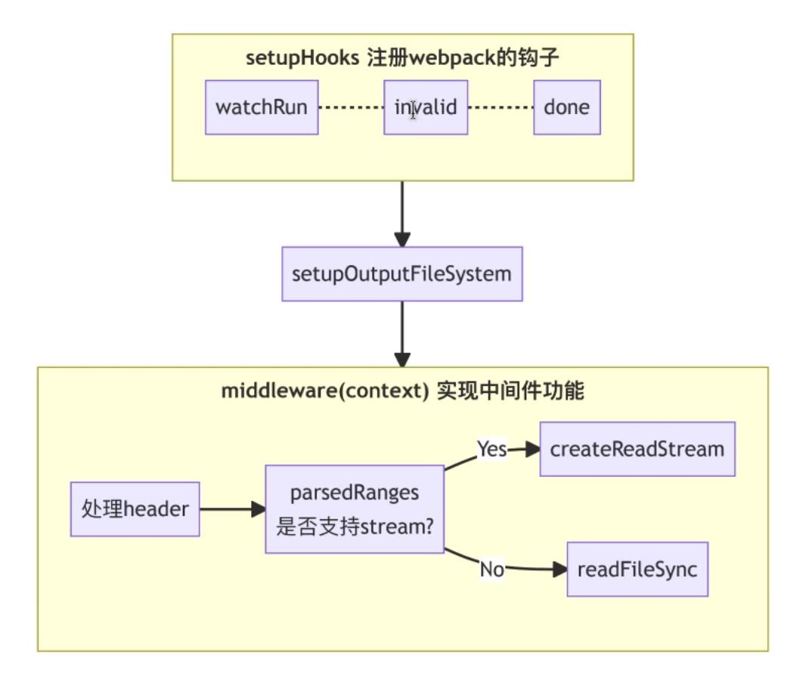
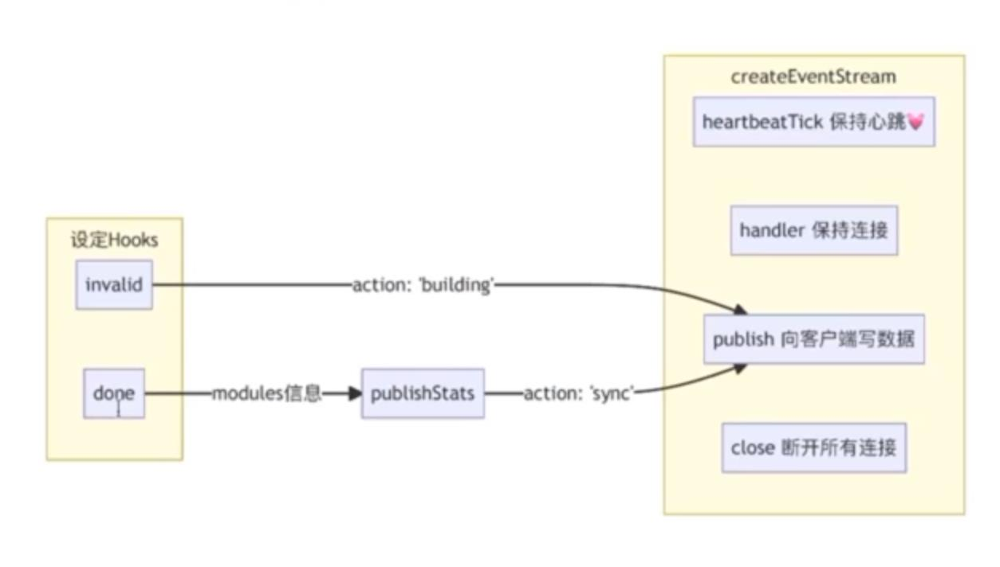
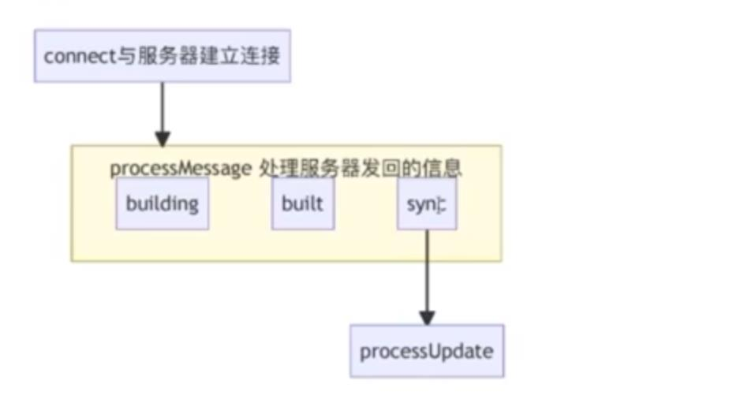

## devMiddleware 中间件核心处理逻辑解析

1. 源代码核心处理流程

- https://github.com/webpack/webpack-dev-middleware/blob/master/src/index.js

2. 扩展：http request header 中的 range 参数

- 有一些浏览器在请求资源时，会发送一个带 range 头的 http 连接，先请求资源的第 0~1 个字节，然后在使用 range 来分段的请求数据；首先发送一个很小的 range 请求，是为了先探知文件的大小，后面在分段请求
- 常用格式为：Range:bytes=first-end。first：开始数据的索引位置。end：结束数据的索引位置
- 例如：
  - Range: bytes=0-99 其实就是前 100 个字符
  - Range: bytes=2-10 第 3 个字符（索引位置为 2）~第 11 个字符（索引位置为 10）
  - Range: bytes=0- 如省略第二个参数，即从索引开始位置，到结束位置
  - Range: bytes=-500 如省略第一个参数，即表示最后 500 个字符

3. 处理流程

- 服务端处理流程 middleware.js
  

- 客户端处理流程 client.js
  

4. timer.unref()
   传统的 timer 会让 nodejs 的事件循环（event loop）保持 active 状态，直到 timer 执行完毕才会退出。使用 unref()之后，不会让事件循环保持 active 状态，如果事件循环中没有其他 active 状态的 timer 的话，nodejs 进程会直接退出，不用等待这个 timer
