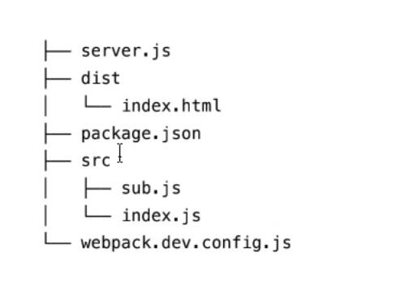

## webpack-dev-middleware

1. 介绍

- https://githup.com/webpack/webpack-dev-middleware
- webpack-dev-server 就是使用 express+webpack-dev-middleware 来实现的
- webpack-dev-middleware 是 express 风格的中间件，可以结合 express 或者其他 node server 服务器来使用
- 用来处理从 webpack 传来的 bundle 文件，再传给 server。他只能在开发模式下使用
- 文件流：webpack ---> webpack-dev-middleware ---> server

2. webpack-dev-middleware 的优点

- 在内存中处理缓存文件，不会将文件写到磁盘上（性能更优）
- 如果在 witch 模式下文件发生改变，中间件会延时处理请求，指导 webpack 编译完成（避免多次重复编译，提升用户体验）
- 支持热更新（HRM）

3. 使用 webpack-dev-middleware 搭建一个简单实例

- 实例目录结构
  
- webpack 的配置
  ```
    const path = require("pacth")
    module.exports = {
      entry: "./src/index.js",
      mode: "development",
      output: {
        filename: "index.js",
        path: path.resolve(__dirname, "dist"),
        publicPath: "/"
      }
    }
  ```
- 需要用到的库
  - webpack
  - webpack-cli
  - webpack-dev-middleware
  - express
