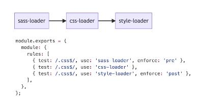
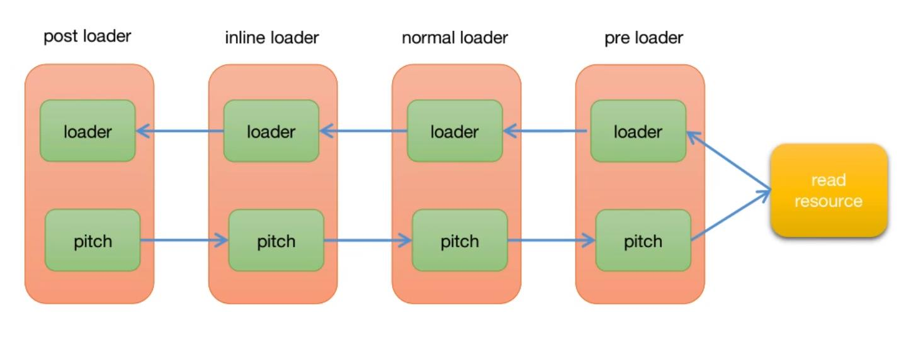
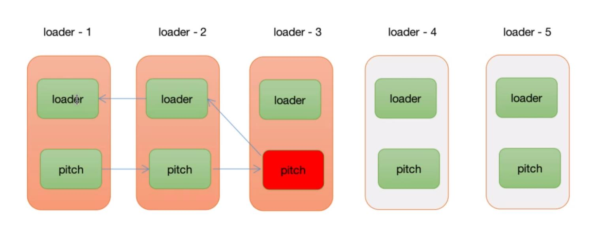
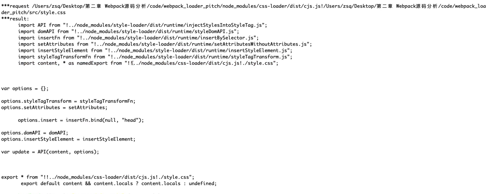

## webpack loader 核心机制分析

1. 什么是 loader

- loader 是一个函数，通过它我们可以在 Webpack 处理特定资源（文件）之前进行预处理。例如将 TypeScript 代码通过 babel-loader 将.ts 文件提前便以为 JavaScript 代码交给 Webpack 处理
- 常用配置参数

```
  [webpack.config.js]
  module.exports = {
    module: {
      rules: [
        {test: /.css$/, use: "css-loader", enforce: "post"},
        {test: /.ts$/, use: "ts-loader"}
      ]
    }
  }
```

- 参数

  - test：是一个正则表达式，根据 test 的规则去匹配文件。如果匹配到，那么改文件就会交给对应得 loader 去处理
  - use：表示匹配到 test 中匹配对于的文件应该使用哪个 loader 的规则去处理，use 值得类型：字符串或者数组（当为数组时执行顺序为：从右往左/从下往上）
  - enforce：pre,前置执行、post，后置执行
    

- loader 的执行顺序
  pre loader -> normal loader -> inline loader -> post loader

- pitch 的执行顺序
  

- pitch 阶段说明

  - loader 的执行阶段分为两个阶段
    - webpack 在使用 loader 处理资源时首先会进过 loader.pitch 阶段
    - pitch 阶段结束后才会读取文件而后进行 normal 阶段处理
  - Pitch 阶段：loader 上的 pitch 方法，按照后置（post）、行内（inline）、普通（normal）、前置（pre）顺序调用
  - Normal 阶段：loader 上的常规方法，按照前置（pre）、普通（normal）、行内（inline）、后置（pre）的顺序调用

  ```
    function loader(){
      // 正常的loader执行阶段
    }
    // remainingRequest：表示剩余需要处理的loader的绝对路径以！分割组成的字符串
    // precedingRequest：表示pitch阶段已经迭代过loader按照！分割组成的字符串
    // data：在pitch和loader之间交互数据
    loader.pitch = function (remainingRequest, precedingRequest, data) {
      // pitch loader
      // 如果return非undefined的值，会带来熔断效果（）
    }
  ```

  

- inline loader
  - 使用!前缀，将禁用所有已配置的 normal loader
  ```
    import Styles from "!style-loader!css-loader?modules!./styles.css"
  ```
  - 使用!!前缀，将禁用所有已配置的 loader（pre loader、normal loader、post loader）
  ```
    import Styles from "!!style-loader!css-loader?modules!./styles.css"
  ```
  - 使用-!前缀，将禁用所有已配置的 pre loader 和 loader，但是不禁用 post loader
  ```
    import Styles from "-!style-loader!css-loader?modules!./styles.css"
  ```

* loader 的种类 （https://webpack.docschina.org/api/loaders）

  - 同步 loader

  ```
    module.exports = function (content, map, meta) {
      return someSyncOperation(content);
    };
  ```

  - 异步 loader

  ```
    function asyncLoader(){
      return Promise((resolve) => {
        // dosomeing
        // resolve的值相当于同步loader的返回值
        resolve("this is the result value")
      })
    }

    function asyncLoader(){
      const callback = this.async()
      // dosomeing
      // 结束运行并把值返回
      callback("this is the result value")
    }
  ```

  - "Raw" loader
    默认情况下，资源文件会转化为 UTF-8 字符串，然后传给 loader。通过设置 raw，loader 可以接收原始的 Buffer。每一个 loader 都可以用 String 或者 Buffer 的形式传递他的处理结果。Complier 将会把它们在 loader 之间相互转换

2. loader 源码解析

- style-loader（https://github.com/webpack-contrib/style-loader/blob/master/src/index.js）
  
