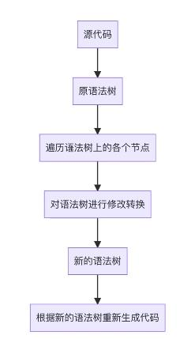
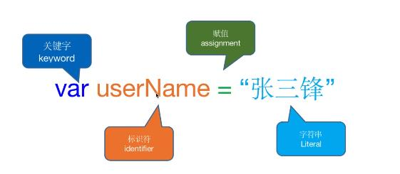

## webpack ast 语法分析

1. ast

- ast 抽象语法树（abstract syntax tree），是源代码的抽象语法结构的树状表现形式。树上的每个节点都表示源代码中的一种结构
- 注意：之所以说语法是【抽象】的，是因为这里的语法并不会表示出真正语法中出现的每个细节。对于计算机来说，无论哪一种语言，都有类型、运算符、流程语句、函数、对象等概念来表达计算机中存在内存中的 0 和 1，以及背后的运算逻辑。
- 使用场景

  - 语法解析、检查
  - 代码格式化、高亮、错误提示、代码自动补全
  - Babel 编译 ES6 语法
  - 代码压缩、混淆代码
  - 可以编写有独特语法特征的高级框架，例如 react、vue 等

- ast 转换工作流程
  

* 分词（tokenize）
  将一行行的源码拆解为一个个 token。所谓 token，是指语法上不可能再分，最小的单个字符或字符串

  

  ```
  demo

  const esprima = require("esprima");
  const estraverse = require("estraverse");
  const escodegen = require("escodegen");

  const fs = require("fs");

  const inputSoure = fs.readFileSync("./index.js").toString();

  // 把代码转换为 ast 树形结构
  const astTree = esprima.parseModule(inputSoure);
  console.log(astTree);

  // 遍历树上的所有节点
  estraverse.traverse(astTree, {
    enter: (node) => {
      if (node.type === "FunctionDeclaration") {
      node.id.name = node.id.name.replace(
      /([A-Z])/g,
      (a) => `_${a.toLowerCase()}`
      );
    }
  },
  leave: () => {
    console.log("done");
    },
  });

  // 把树形结构转换为源代码
  const newCode = escodegen.generate(astTree);
  console.log(newCode);
  fs.writeFileSync("./output.js", newCode);
  ```

* webpack 转换源代码
  - webpack 是使用 acornjs 来解析 js 为 ast（源路径：https://github.com/webpack/webpack/blob/main/lib/javascript/JavascriptParser.js）
  - webpack 是使用 CssParser.js 来解析 css 语法树（源路径：https://github.com/webpack/webpack/blob/main/lib/css/CssParser.js）
    - eatWhiteLine: 删除空白行
    - eatUntil：删除符合条件之前的内容
    - eatText：删除注释并返回新字符串
