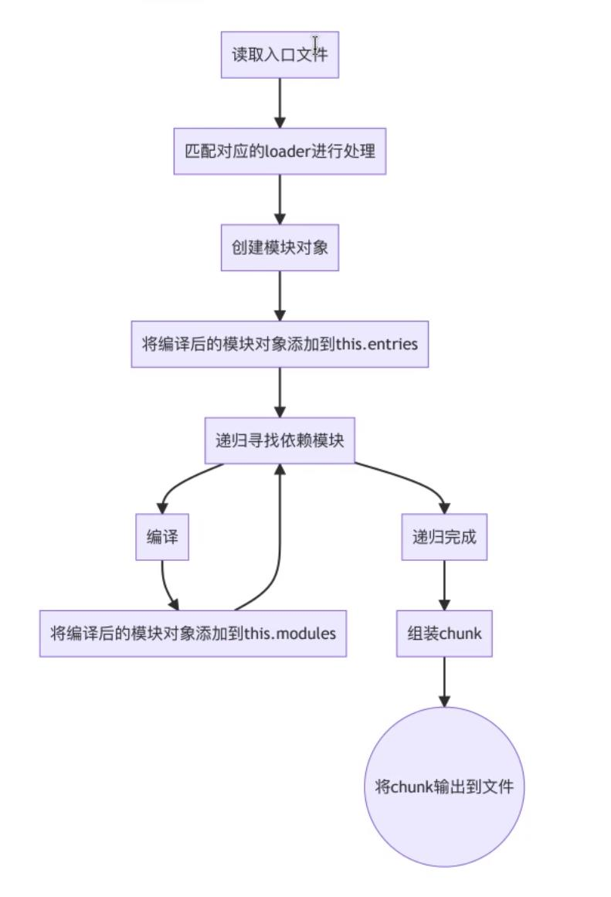

## Webpack 依赖模块编译流程

1. 准备 compiler 对象

- 从命令行接受参数或读取配置文件 webpack.config.js
- 通过 hooks 注册插件
- 创建 compiler 对象
  

2. 依赖图（dependency graph）

- 任何时候，一个文件依赖于另一个文件，Webpack 就把此视为文件之间有依赖关系。这使得 Webpack 可以接收非代码资源（none-code asset,例如图像或 web 字体），并且可以把它们作为依赖提供给你的应用程序
- Webpack 从命令行或配置文件定义的一个模块列表开始，处理你的应用程序，从这些入口起点开始，Webpack 递归的构建一个依赖图，这个依赖图包含着应用程序所需的每个模块，然后将所有这些模块打包为少量的 bundle（通常只有一个）可由浏览器加载

3. 模块解析

- 解析规则
  - 绝对路径
    ```
      import "./home/me/file"
      import "C:\\Users\\me\\file"
    ```
  - 相对路径
    ```
      import "../src/file1"
      import "../file2"
    ```
  - 模块路径
    - 模块将在 resolve.modules 中指定的所有目录内搜索，你可以替换初始模块路径，此替换路径通过使用 resolve.alias 配置选项来创建一个别名
    ```
      import "module"
      import "module/lib/file"
    ```
    - 如果路径指向一个文件
      - 如果路径具有文件扩展名，则改文件直接被打包
      - 否则，将使用[resolve.extension]选项作为文件扩展名来解析，此选项告诉解析器在解析中能够接受那些扩展名（例如：.js、.jsx）
    - 如果路径指向一个文件夹，则采取以下步骤找到具有正确扩展名的正确文件
      - 如果文件夹中包含 package.json 文件，则按照顺序查找 resolve.mainfields 配置项中指定的字段。并且根据从 package.json 中匹配到的第一个字段来确定文件路径
      - 如果 package.json 文件不存在或者 package.json 文件中的 mainFields 字段没有返回一个有效路径，则按照顺序查找 resolve。mainFields 配置选项中指定的文件名，看是否能在 impory/require 文件找到
