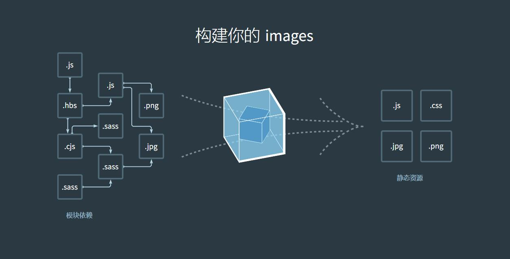

## npm+webpack 原理

1. npm

- npm 的全称是 Node Package Manager，是一个 NodeJS 包管理和分发工具，已经成为了官方的发布 Node 模块（包）的标准
- 特点：
  - 所有模块都在仓库中集中管理，统一分发使用
  - 在 package.json 文件中记录模块信息、依赖关系等
  - 通过 publish 命令发布到仓库
  - 通过 install 进行安装

2. npm 的使用和原理

- npm init：创建项目
- npm install：安装模块
- npm publish：上传到仓库（public/private）
- npm run xxx：执行指定的脚本
- npm info：查看包信息
- npm config：配置信息（不同项目可以通过.npmrc 配置）

3. webpack

- 发展历史：
  - 2012 年 3 月 10 日诞生
  - 又德国人 Tobias（java 工程师），从事将 java 转为 js 的研究（GWT），里面有个特性叫做“code splitting”
  - “code splitting”就是 Webpack 现在提供的主要功能
- 原理：
  - Webpack 是一个前端资源加载/打包工具。它根据模块的依赖关系进行静态分析，然后将这些模块按照指定的规则生成对应的静态资源
  - Webpack 可以将多种静态资源 js、css、less 转换成一个静态文件，从而减少页面请求



4. 核心概念

- Entry（入口文件，可以是多个）
- Output（输出文件）
- Module（模块，webpack 中一切皆模块，编译时会递归查找所有依赖的模块）
- Chunk（代码块，一个代码块由多个模块组成，用于代码合并与分割）
- Loader（可以让 webpack 去处理非 JavaScript 的资源，转化为 webpack 能处理的模块）

```
  [webpack.config.js]
  module.exports = {
    mode: "development",
    entry: "index.js",
    output: {
      path: __driname,
      filename: "./bundle.js"
    }
  }
```
