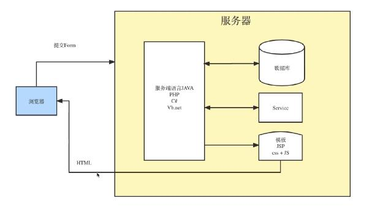
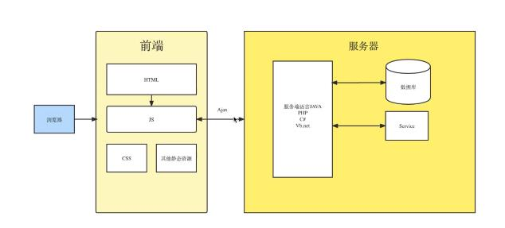

## 前端工程化发展历史

##### 前端的发展史是一个从简单到复杂，从原始到现代的进化史。随着科技爆发，互联网已经渗透到我们生活的方方面面，成为日常生活的重要组成部分，以科技拉平人们信息获取的方式，交互方式也从能看够用，到多渠道的极致体验，不仅包括动画，声音，视频，甚至还有 AR 和 VR。前端工程化在整个演进过程中扮演着重要的角色

1. 什么是前端工程化？
   前端工程化是一切以提高效率、减低成本、保证质量的手段。主要包含编码、发布、运维整个前端开发周期。而众所周知的 webpack 其实只是其中的一部分。

2. 前端发展历程
   （1995）Brendan Eich 发明 Javascript
   |
   （2005）Ajax 广泛应用（Web2.0 蓬勃发展）
   |
   （2008）V8 引擎发布
   |
   （2009）Node.js 发布
   |
   （2010）NPM 0.1 版发布（为大前端打下基础）
   |
   （2013）Webpack 1.0 发布
   |
   （2013）React 1.0 版发布
   |
   （2014）Vue 1.0 版发布（真正意义上的大前端时代）
3. 开发方式的演进
   （1995-2005）石器时代：原始全栈开发，服务端渲染，少量食用 Javascript
   |
   （2005-2013）农业社会：前后端分离，利用 Ajax 实现前后端分离（实现页面局部刷新），SPA 模式萌芽
   |
   （2013-2014）工业时代：模块化开发兴起，npm 管理（造轮子，减少代码重复工作），webpack 编译打包
   |
   （2014-now）现代化：基于 Angular、React、Vue 等框架（面向对象、面向业务编程）

## 服务器渲染

## 前后端分离

将页面渲染部分拿到用户客户端处理，可以减少服务器 CPU 资源，可以处理更多的业务，更好的解决高并发等问题

## 组件化

任务单元变为功能模块，业务逻辑开始向前端转移，最终在 js 打包工具把文件、js、css 打包成一个或多个 bundle 文件。编写时是分开编写，由工程化工具统一打包

## 主流前端技术栈

框架：Vue、React、Angular
语言：TS、ES6
功能化工具：Webpack、Vite、Rollup、Gulp
跨平台技术：Electron、React Native、Flutter、小程序

## 前端工程化解决了哪些痛点

1. 模块化与共通化：解决了作用域冲突，充分代码复用
2. 统一编码规范：提升工程质量
3. 提高访问性能：合并压缩
4. 优雅降级：通过 loader 和 plugin 来实现低版本浏览器的兼容

## 扩展

### Web 1.0

1. 1994
2. PC 互联网
3. 门户时代
4. 被动接受内容

### Web 2.0

1. 2008
2. 移动互联网（智能手机）
3. 社交网络、O2O、手机游戏、短视频、网络直播、信息流服务、应用分发和互联网金融
4. 自主创建内容（流量入口和利益分配被互联网巨头把控，安全问题难以保证）

### Web 3.0

1. 去中心化（用户数据将不再被互联网巨头把控，）
2. 加密
3. 用户可以真正拥有自己的数据
