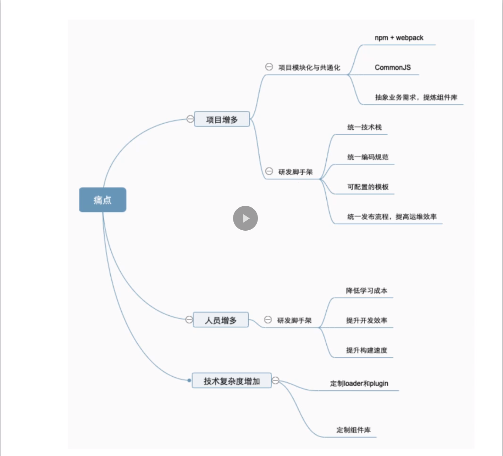

## 前端工程化的应用场景

1. 解决从开发到发布全流程的问题
   项目的核心三要素：时间、质量、成本

- 时间:现代项目尤其互联网项目的特点就是快，提升开发效率，在短时间内实现功能的迭代升级（大多数互联网项目是商务模式的创新，而非技术的创新）
  a）脚手架：create-react-app、vue-cli，创建项目、开箱即用、热更新
  b）js 兼容：ES6/ts -> babel-loader -> ES5，sass/less -> css
- 质量：
  a）代码质量：通过规范来实现，文档形式的规范和通过 lint 实现的工程化规范
  b）性能：提升用户体验（代码压缩等）
- 成本：
  a）模块化和共通性
  b）自动发布（git hook 加运维）

2. 传统企业前端项目重构
   传统企业中依然还有很多的现行系统使用传统的前端技术栈：

- HTML + JS + Ajax
- 静态资源未优化
- 发布流程半自动化
  重构思路：使用打包工具 webpack 等对 js 等静态资源进行打包合并压缩，结合运维工具使得流程自动化，使用现代化框架，以便更好的模块化

3. 现代企业项目升级
   现在企业在成长过程中会产生大“企业病”：

- 项目增加：新业务线，新的组织产生都会产生新的项目，这个增长不是简单的线性关系（不同的项目应尽量使用相同的发布方式）
- 人员增多：开发团队人数增加，人员水平有差异（使用 lint 规范代码格式，使用合适的 loader 兼容低浏览器，让技术、业务理解能力强的同学造轮子，对业务的 review）
- 复杂度变高：业务复杂度提升带来技术复杂度的提升，业务场景的变化也会产生跨终端的需求（需要开发自己的组件库，把公司标准的业务需求沉淀到组件中，让跨终端需求降低为 UI 需求而脱离业务）

