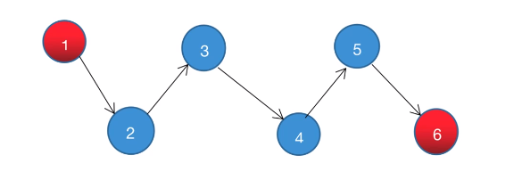
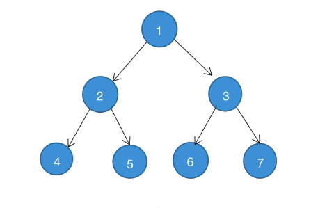

## 逻辑结构与存储结构

数据结构是计算机中存储、组织数据的方式，数据元素之间存在的一种或多种特定关系的数据元素集合

1. 逻辑结构
   逻辑结构就是数据之间的关系，逻辑结构分两大类：线性结构、非线性结构

- 线性结构

  - 是有序的数据元素的集合，数据元素之间存在 1 对 1 的线性关系
  - 特点
    - 集合中必存在唯一的一个“第一个元素”
    - 集合中必存在唯一的一个“最后的元素”
    - 除最后元素之外，其他数据元素均有唯一的“后继”
    - 除第一元素之外，其他数据元素均有唯一的“前驱”
      
  - 常用的线性结构有：栈、队列、链表、线性表、字符串

- 非线性结构
  - 非线性结构中各个数据元素不在保持在一个线性序列中
  - 每个数据元素可能在零个或者多个其他数据元素发生联系。根据关系的不同，可分为层次结构和群结构
  - 常见的非线性结构有：二位数组、多维数组、集合、树、图
    

2. 存储结构
   数据的存储结构是指数据的逻辑结构在机算计中的表示

- 数据元素之间的关系有两种不同的表示法：顺序映像 和 非顺序映像
- 并由此得到两种不同的存储结构：顺序存储结构 和 非顺序存储结构
  - 顺序存储方式就是在一块连续的存储区域一个接着一个的存放数据，例如：数组在内存中的位置是连续的，它就属于顺序存储
  - 链式存储方式比较灵活，不要求逻辑上相邻的节点在物理位置上相邻，节点间的逻辑关系由附加的引用字段来表示
  - 链表是主动建立数据间的关联关系的，在内存中却不一定是连续的，它属于链式存储
  - 顺序和逻辑上都不存在顺序关系的方式-散列存储方式是根据节点的关键字直接计算出该节点的存储地址的一种存储方式
  - 索引存储方式是采用附加的索引表的方式来存储节点信息的一种存储方式
    - 索引表由若干索引项组成。索引存储方式中索引项的一般形式为（关键字、地址）。其中，关键字是能够唯一标识一个节点的数据项
    - 稠密索引：这种方式中每个节点在索引表中都有一个索引项，其中索引项的地址是其节点所在的存储位置
    - 稀疏索引：这种方式中一组节点在索引表中对应一个索引项，索引项的地址是其一组节点的其实存储位置
